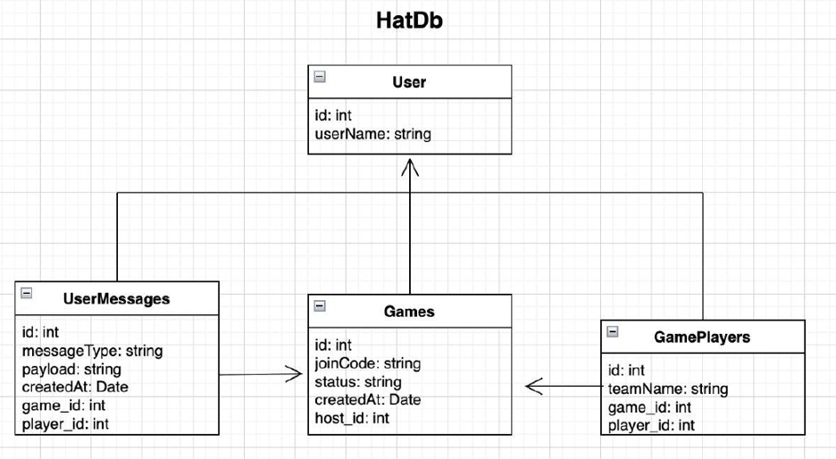

# 🎩 Hat Game — Backend Server

REST API сервер для мультиплеерной iOS-игры **«Шляпа»**. Отвечает за управление пользователями, игровыми комнатами и игровыми сообщениями. Сервер был успешно задеплоен и обеспечивал реальный мультиплеер в мобильном приложении.

📱 **iOS-приложение:** [github.com/OfficeKlerk/Hat](https://github.com/OfficeKlerk/Hat)

---

## 📋 Описание

Сервер реализует всю серверную логику для онлайн-игры «Шляпа»: регистрацию игроков, создание игровых комнат с уникальным кодом входа, управление составом команд и передачу игровых сообщений между участниками.

---

## 🛠️ Стек технологий

- **Swift 6** + **Vapor 4** — server-side Swift фреймворк
- **Fluent** + **FluentPostgresDriver** — ORM и работа с БД
- **PostgreSQL 16** — реляционная база данных
- **SwiftNIO** — асинхронная event-driven сеть
- **Docker** / **Docker Compose** — контейнеризация и деплой

---

## 🏗️ Архитектура

```
Controller → Model (Fluent ORM) → PostgreSQL
```

Четыре контроллера, каждый отвечает за свою сущность:

- **UserController** — управление игроками
- **GameController** — управление игровыми комнатами
- **GamePlayersController** — управление составом комнат
- **UserMessagesController** — игровые сообщения между участниками

Миграции базы данных применяются автоматически при старте (`autoMigrate`). Конфигурация БД берётся из переменных окружения.

---

## 🗄️ Схема базы данных



### User — игрок
| Поле | Тип | Описание |
|---|---|---|
| `id` | UUID | Уникальный идентификатор |
| `user_name` | String | Имя игрока |

### Game — игровая комната
| Поле | Тип | Описание |
|---|---|---|
| `id` | UUID | Уникальный идентификатор |
| `join_code` | String | Код входа в комнату (уникальный) |
| `status` | String | Статус игры |
| `created_at` | Date | Дата создания |
| `host_id` | UUID | Ссылка на хоста (User) |

### GamePlayer — участник комнаты
| Поле | Тип | Описание |
|---|---|---|
| `id` | UUID | Уникальный идентификатор |
| `team_name` | String | Название команды |
| `game_id` | UUID | Ссылка на игру (Game) |
| `player_id` | UUID | Ссылка на игрока (User) |

### UserMessage — игровое сообщение
| Поле | Тип | Описание |
|---|---|---|
| `id` | UUID | Уникальный идентификатор |
| `message_type` | String | Тип сообщения |
| `payload` | String | Содержимое сообщения |
| `created_at` | Date | Дата создания |
| `game_id` | UUID | Ссылка на игру (Game) |
| `player_id` | UUID | Ссылка на отправителя (User) |

---

## 🔌 API Endpoints

### Users `/users`
| Метод | Endpoint | Описание |
|---|---|---|
| `GET` | `/users` | Получить всех пользователей |
| `GET` | `/users/:userID` | Получить пользователя по ID |
| `POST` | `/users` | Создать пользователя |
| `PUT` | `/users/:userID` | Обновить пользователя |
| `DELETE` | `/users/:userID` | Удалить пользователя |

### Games `/games`
| Метод | Endpoint | Описание |
|---|---|---|
| `GET` | `/games` | Получить все игровые комнаты |
| `GET` | `/games/:gameID` | Получить комнату по ID |
| `POST` | `/games` | Создать игровую комнату |
| `PUT` | `/games/:gameID` | Обновить комнату |
| `DELETE` | `/games/:gameID` | Удалить комнату |

### Game Players `/game-players`
| Метод | Endpoint | Описание |
|---|---|---|
| `GET` | `/game-players` | Получить всех участников |
| `GET` | `/game-players/:gamePlayerID` | Получить участника по ID |
| `POST` | `/game-players` | Добавить участника в комнату |
| `PUT` | `/game-players/:gamePlayerID` | Обновить участника |
| `DELETE` | `/game-players/:gamePlayerID` | Удалить участника из комнаты |

### Messages `/messages`
| Метод | Endpoint | Описание |
|---|---|---|
| `GET` | `/messages` | Получить все сообщения |
| `GET` | `/messages/:messageID` | Получить сообщение по ID |
| `POST` | `/messages` | Отправить сообщение |
| `PUT` | `/messages/:messageID` | Обновить сообщение |
| `DELETE` | `/messages/:messageID` | Удалить сообщение |

### Коды ответов
| Код | Описание |
|---|---|
| `200 OK` | Успешная операция |
| `201 Created` | Ресурс создан |
| `400 Bad Request` | Невалидные данные |
| `404 Not Found` | Ресурс не найден |
| `409 Conflict` | Конфликт (дублирование join_code, игрок уже в комнате) |

---

## 🚀 Запуск

### Требования
- Docker и Docker Compose

### Установка

```bash
# Клонировать репозиторий
git clone https://github.com/OfficeKlerk/UsersDBManager.git
cd UsersDBManager

# Собрать и запустить
docker compose build
docker compose up app
```

Сервер запустится на `http://localhost:8080`. Миграции БД применяются автоматически при старте.

### Переменные окружения

| Переменная | Значение по умолчанию | Описание |
|---|---|---|
| `DATABASE_HOST` | `localhost` | Хост PostgreSQL |
| `DATABASE_PORT` | `5432` | Порт PostgreSQL |
| `DATABASE_USERNAME` | `vapor` | Имя пользователя БД |
| `DATABASE_PASSWORD` | `vapor` | Пароль БД |
| `DATABASE_NAME` | `vapor_database` | Имя базы данных |

---

## 📁 Структура проекта

```
├── Sources/UsersDbServer/
│   ├── Controllers/
│   │   ├── UserController.swift         # CRUD для пользователей
│   │   ├── GameController.swift         # CRUD для игровых комнат
│   │   ├── GamePlayersController.swift  # CRUD для участников комнат
│   │   └── UserMessagesController.swift # CRUD для сообщений
│   ├── Models/
│   │   ├── User.swift                   # Модель игрока
│   │   ├── Game.swift                   # Модель игровой комнаты
│   │   ├── GamePlayer.swift             # Модель участника
│   │   └── UserMessage.swift            # Модель сообщения
│   ├── DTO/                             # Объекты запросов и ответов
│   ├── Migrations/                      # Миграции БД (Fluent)
│   ├── Extensions/
│   │   └── RequestExtension.swift       # Хелперы ok()/fail() для ответов
│   ├── configure.swift                  # Конфигурация приложения
│   └── routes.swift                     # Регистрация маршрутов
├── docs/
│   └── db_diagram.png                   # Схема базы данных
├── docker-compose.yml
├── Dockerfile
└── Package.swift
```

---

## 🔗 Связанные проекты

- 📱 [Hat — iOS приложение](https://github.com/OfficeKlerk/Hat)